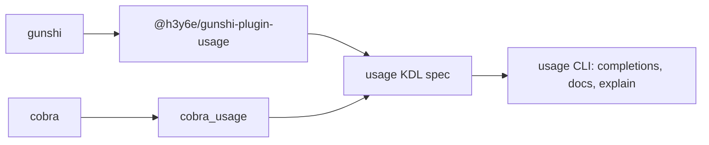

# Fidelity

How faithfully the [usage](https://usage.jdx.dev) spec from gunshi-plugin-usage describes a gunshi CLI.

- [Coverage](coverage/README.md): which spec keys the plugin writes, compared with cobra_usage
- [Behavior](behavior/README.md): whether usage reads command lines as gunshi does
